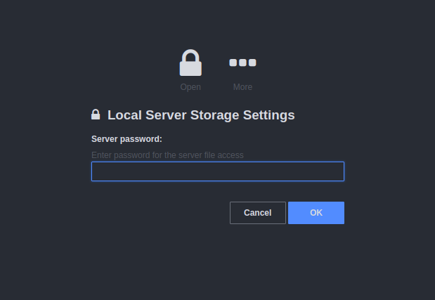
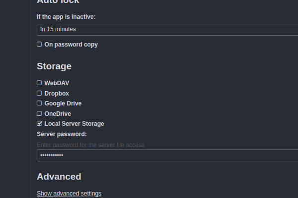

# keeweb-local-server

This plugin adds support for simple storage on self hosted server.
Reading and writing is done through simple php script `server.php`. 

Users are prompt to enter access password for reading or writing to server storage (password can be set in php script). 
It should be easy to rewrite server-side storage script to other programming languages as well.

Server file access prompt dialog

Global settings to configure server file access

## Installation
Following installation script requires wget and unzip. Simply run

`wget -O - https://raw.githubusercontent.com/vavrecan/keeweb-local-server/master/install.sh | bash`

then copy files to website root directory or test with local webserver 

`php -S localhost:8080`

## Manual Installation
Download keeweb html version from [https://github.com/keeweb/keeweb/releases](https://github.com/keeweb/keeweb/releases), 
copy files from this repository and make changes to the `index.html` file

`<meta name="kw-config" content="(no-config)">`

to 

`<meta name="kw-config" content="config.json">`

Update read / write password in `server.php` and configure path to keepass databases.

## Author
- [Marek Vavrecan](mailto:vavrecan@gmail.com)
- [Donate by PayPal](https://www.paypal.me/vavrecan)

## License
- [GNU General Public License, version 2](http://www.gnu.org/licenses/gpl-2.0.html)
